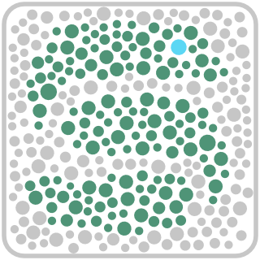

# `slide_snake`
  
## **Flexible alignment workflow for spatial transcriptomics data**  

The goal of this project is to build a snakemake workflow for assessing different preprocessing, alignment, and quantification configurations, and digging into artifacts.  


## **Dependencies**:
- `cutadapt` [v3.4](https://cutadapt.readthedocs.io/en/stable/)
- `fastqc` [v0.11.8](https://www.bioinformatics.babraham.ac.uk/projects/fastqc/)
- `STAR` [v2.7.10a](https://github.com/alexdobin/STAR)
- `kallisto` [v](https://pachterlab.github.io/kallisto/)
- `samtools`[v1.17](http://www.htslib.org/)
- `qualimap` [v2.2.2a](http://qualimap.conesalab.org/)
- `AnnData` [v0.9.1](https://anndata.readthedocs.io/en/latest/)
- `scanpy` [v1.7.2](https://scanpy.readthedocs.io/en/stable/)
- `vsearch` [v2.17.0_linux_x86_64](https://github.com/torognes/vsearch)
- `BLAST`  
*Note-* these are the versions I used, not necessarily the only versions which will work

### Install w/ `mamba`/`conda`:
```
mamba create --name slide_snake -c bioconda cutadapt fastqc star=2.7.11a kallisto bustools samtools bamtools qualimap anndata scanpy vsearch blast umi_tools

mamba activate slide_snake
```

I had solve issues putting snakemake into the same conda environment- if you don't have snakemake installed locally, I would recommend making a second environment which just has snakemake in it, then loading that environment before `slide_snake`. Example (assuming you already built the above `slide_snake` env):
```
mamba create --name snakemake_only -c bioconda snakemake
mamba activate snakemake_only
mamba activate slide_snake
```

### Example run w/ `slurm`:
```
snakemake --cluster-config slurm_config.yml \
--cluster "sbatch --mail-type {cluster.mail-type} --mail-user {cluster.mail-user} -p {cluster.partition} -t {cluster.time} -N {cluster.nodes} --mem {cluster.mem} -D {cluster.chdir} -o {cluster.output}" \
-j 32 -k -p --nt
```
### Example run w/out `slurm`:
```
snakemake -k -p --nt -j 32 
```


## **Trimming:**
<details close>
<summary> Five Prime adapter(s): </summary>
- Reverse complement of the SlideSeq TSO to reduce strand invasion artifacts [**CCCATTCACTCTGCGTTGATACCAGCTT**]  
</details>

<details close>
<summary> Three Prime adapter(s): </summary>

- "A" homopolymers [**100-A**]  
- "G" homopolymers, important for Illumina 2-color sequencers [**100-G**]  
- "T" homopolymers [**100-T**]  
- Nextera adapter sequence [**CTGTCTCTTATA**]  
- Reverse complement of Nextera sequence [**TATAAGAGACAG**]  
- Curio template switch olgo (TSO) - remove any polyadenylated TSOs [**AAGCTGGTATCAACGCAGAGTGAATGGG**]  
- Curio R1 internal adapter - shows up in R2, and used for R1 trimming [**TCTTCAGCGTTCCCGAGA**]  
- Reverse of Curio R1 adapter [**AGAGCCCTTGCGACTTCT**]  
- Illumina unversal sequence [**AGATCGGAAGAG**]  
</details>

## **Alignment:**
<details close>
<summary> STAR </summary>
  
- After adapter trimming, reads are aligned with `STARsolo` and `kallisto`/`bustools` to generate count matrices  
- Outputs are in `{SAMPLE_ID}/STARsolo/Solo.out` & `{SAMPLE_ID}/kb/counts_unfiltered`  
- Different recipes are written out in `resources/recipe_sheet.csv`, and must be specified for each sample within the sample sheet  

### Generating references:
#### rRNA STAR reference for in silico rRNA depletion/quantification
Ribosomal RNA (rRNA) molecules can make alignment/quantification very difficult because of the number of genomic copies of these genes. We added a first-pass-alignment just to rRNA sequences to enable stratified parameterization for these sequences, but maintain the ability to count and analyze them.  

Check out `scripts/GRCm39_GENCODEM31_STAR_rRNA.sh` for an example script showing how to generate a rRNA-only STAR reference using GENCODE annotations.  

Other option- download rRNA sequences from  with the following query:
`(expert_db:"SILVA" AND TAXONOMY:"10090") AND entry_type:"Sequence"`

#### Genomic STAR reference
This is a typical STAR reference that you would use for any other alignment job. Here is an example code snippet:
```
FASTA_DIR="/path/to/GENCODE_M31/GRCm39.genome.fa"
GENES_DIR="/path/to//GENCODE_M31/gencode.vM31.annotation.gtf"

OUTDIR="/workdir/dwm269/genomes/mm39_all/STAR_GRCm39_GENCODEM31"

mkdir -p ${OUTDIR}
cd ${OUTDIR}

STAR \
--runThreadN 16 \
--runMode genomeGenerate \
--genomeDir ${OUTDIR} \
--genomeFastaFiles ${FASTA_DIR} \
--sjdbGTFfile ${GENES_DIR} \
--sjdbGTFfeatureExon exon
```
*You can find the reference files on [GENCODE's website](https://www.gencodegenes.org/mouse/)*
</details>


<details close>
<summary> kallisto/BUStools </summary>
  
TODO
</details>  


## **Recipe descriptions**:
<details close>
<summary> SlideSeq/Seeker (Curio) </summary>
  
- `seeker_v3.1` - Hard trim the adapter read positions in R1, and use the best barcode correction algorithms in STARsolo
- `seeker_v3.1_noTrim` - No hard trimming, and use the base positions for barcode/UMI (*Note*, this recipe doesn't work well w/ Curio Seeker b/c of in/del issues w/ the barcode synthesis)
- `seeker_v3.1_noTrimMatchLinker` - Match the adapter sequence on R1 (w/ 2 mismatches allowed) and infer barcodes/UMIs from that position (*Note* best performer w/ Curio data)
- `seeker_v3.1_noTrim_total` - Same as `seeker_v3.1_noTrimMatchLinker`, but with additional STAR parameters for total RNAseq alignment (more multimappers, looser alignment)
</details>

<details close>
<summary> StereoSeq/STOmics (BGI) </summary>
  
- `stomics_noTrim` - Standard alignment for StereoSeq/STOmics (BGI) data
- `stomics_noTrim_total` - Total RNA alignment for StereoSeq/STOmics (BGI) data
</details>

<details close>
<summary> Add new recipe: </summary>
Just add  a new line in `resources/recipe_sheet.csv`, and reference it based on the name you use in the leftmost column!
</details>

## **Barcode handling:**
<details close>
<summary> STAR </summary>
  
- Removed the linker sequence in R1 so that the `1MM_multi` barcode correction in `STARsolo` can be used
- Barcode & UMI paramters for [`STAR`](https://github.com/alexdobin/STAR/blob/master/docs/STARsolo.md):
```
--soloType CB_UMI_Simple	\
--soloUMIstart 14 \
--soloUMIlen 7 \
--soloCBstart 1 \
--soloCBlen 14
```
</details>

<details close>
<summary> kallisto/bustools </summary>
  
- Barcode & UMI paramters for `kallisto bus`
```
-x 0,0,14:0,14,21:1,0,0
```
- Outputs are in

</details>

## **QC:**
- `fastqc` is run on R2 files before (`preTrim`) and after (`postTrim`) adapter trimming
- `qualimap` is used to assess `STAR` alignment

## **Unmapped read analysis:**
- `fastqc` is run on all unmapped reads from `STAR`
- The most abundant unmapped reads are also aligned with `blast`

## **Output file tree:**
#TODO- missing .h5ad files
```
{SAMPLE_ID}/
├── log.cutadapt.json
├── kb
│   ├── counts_unfiltered
│   │   ├── output.barcodes.txt
│   │   ├── output.genes.txt
│   │   └── output.mtx
│   ├── inspect.corrected.bus.json
│   ├── kallisto_align.log
│   ├── matrix.ec
│   ├── output.bus
│   ├── output.corrected.bus
│   ├── output.sorted.bus
│   ├── run_info.json
│   └── transcripts.txt
├── postTrim_fastqc_R1
│   ├── {SAMPLE_ID}_R1_adapterTrim_fastqc.html
│   └── {SAMPLE_ID}_R1_adapterTrim_fastqc.zip
├── postTrim_fastqc_R2
│   ├── {SAMPLE_ID}_R2_final_fastqc.html
│   └── {SAMPLE_ID}_R2_final_fastqc.zip
├── preTrim_fastqc_R1
│   ├── {SAMPLE_ID}_R1_fastqc.html
│   └── {SAMPLE_ID}_R1_fastqc.zip
├── preTrim_fastqc_R2
│   ├── {SAMPLE_ID}_R2_fastqc.html
│   └── {SAMPLE_ID}_R2_fastqc.zip
├── qualimap
│   ├── css
│   │   ├── agogo.css
│   │   ├── ajax-loader.gif
│   │   ├── basic.css
│   │   ├── bgfooter.png
│   │   ├── bgtop.png
│   │   ├── comment-bright.png
│   │   ├── comment-close.png
│   │   ├── comment.png
│   │   ├── doctools.js
│   │   ├── down.png
│   │   ├── down-pressed.png
│   │   ├── file.png
│   │   ├── jquery.js
│   │   ├── minus.png
│   │   ├── plus.png
│   │   ├── pygments.css
│   │   ├── qualimap_logo_small.png
│   │   ├── report.css
│   │   ├── searchtools.js
│   │   ├── underscore.js
│   │   ├── up.png
│   │   ├── up-pressed.png
│   │   └── websupport.js
│   ├── images_qualimapReport
│   │   ├── Coverage Profile Along Genes (High).png
│   │   ├── Coverage Profile Along Genes (Low).png
│   │   ├── Coverage Profile Along Genes (Total).png
│   │   ├── Junction Analysis.png
│   │   ├── Reads Genomic Origin.png
│   │   └── Transcript coverage histogram.png
│   ├── qualimapReport.html
│   ├── raw_data_qualimapReport
│   │   ├── coverage_profile_along_genes_(high).txt
│   │   ├── coverage_profile_along_genes_(low).txt
│   │   └── coverage_profile_along_genes_(total).txt
│   └── rnaseq_qc_results.txt
├── STARsolo
│   ├── Aligned.sortedByCoord.out.bam
│   ├── Aligned.sortedByCoord.out.bam.bai
│   ├── Log.final.out
│   ├── Log.out
│   ├── Log.progress.out
│   ├── SJ.out.tab
│   ├── Solo.out
│   │   ├── Barcodes.stats
│   │   ├── Gene
│   │   │   ├── Features.stats
│   │   │   ├── filtered
│   │   │   │   ├── barcodes.tsv.gz
│   │   │   │   ├── features.tsv.gz
│   │   │   │   └── matrix.mtx.gz
│   │   │   ├── raw
│   │   │   │   ├── barcodes.tsv.gz
│   │   │   │   ├── features.tsv.gz
│   │   │   │   ├── matrix.mtx.gz
│   │   │   │   └── UniqueAndMult-EM.mtx.gz
│   │   │   ├── Summary.csv
│   │   │   └── UMIperCellSorted.txt
│   │   ├── GeneFull
│   │   │   ├── Features.stats
│   │   │   ├── filtered
│   │   │   │   ├── barcodes.tsv.gz
│   │   │   │   ├── features.tsv.gz
│   │   │   │   └── matrix.mtx.gz
│   │   │   ├── raw
│   │   │   │   ├── barcodes.tsv.gz
│   │   │   │   ├── features.tsv.gz
│   │   │   │   ├── matrix.mtx.gz
│   │   │   │   └── UniqueAndMult-EM.mtx.gz
│   │   │   ├── Summary.csv
│   │   │   └── UMIperCellSorted.txt
│   │   └── Velocyto
│   │       ├── Features.stats
│   │       ├── filtered
│   │       │   ├── ambiguous.mtx.gz
│   │       │   ├── barcodes.tsv.gz
│   │       │   ├── features.tsv.gz
│   │       │   ├── spliced.mtx.gz
│   │       │   └── unspliced.mtx.gz
│   │       ├── raw
│   │       │   ├── ambiguous.mtx.gz
│   │       │   ├── barcodes.tsv.gz
│   │       │   ├── features.tsv.gz
│   │       │   ├── spliced.mtx.gz
│   │       │   └── unspliced.mtx.gz
│   │       └── Summary.csv
│   ├── Unmapped.out.mate1.fastq.gz
│   └── Unmapped.out.mate2.fastq.gz
├── tmp
│   ├── whitelist_1.txt
│   ├── whitelist_2.txt
│   └── whitelist.txt
├── Unmapped_fastqc
│   ├── Unmapped.out.mate1_fastqc.html
│   ├── Unmapped.out.mate1_fastqc.zip
│   ├── Unmapped.out.mate2_fastqc.html
│   └── Unmapped.out.mate2_fastqc.zip
└── Unmapped.out.mate2_blastResults.txt
```

## **Helpful links:**
- [Barcode download from Curio](https://curiobioscience.com/support/barcode/)
- Extract DNB barcode whitelist with [ST_BarcodeMap](https://github.com/STOmics/ST_BarcodeMap) 
  - Use the "mask format change" code mentioned in the `README`

## **small/micro RNA analysis:**
Work-in-progress...****
### miRge3.0
- [Link to documentation](https://mirge3.readthedocs.io/en/latest/quick_start.html)
- [Link to library download](https://sourceforge.net/projects/mirge3/files/miRge3_Lib/)

### small RNA reference data bases:
- **piRNAs** - [pirbase](http://bigdata.ibp.ac.cn/piRBase/), v3.0
  - *Note* - use "gold standard" piRs b/c there are wayyyyy too many predicted sequences...
- **miRNAs** - [mirbase](https://mirbase.org/), v22
  - #TODO - Use both hairpin & mature sequences, in that order 
